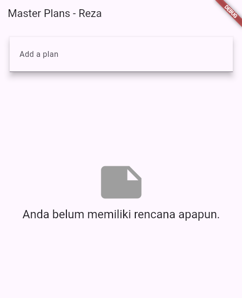
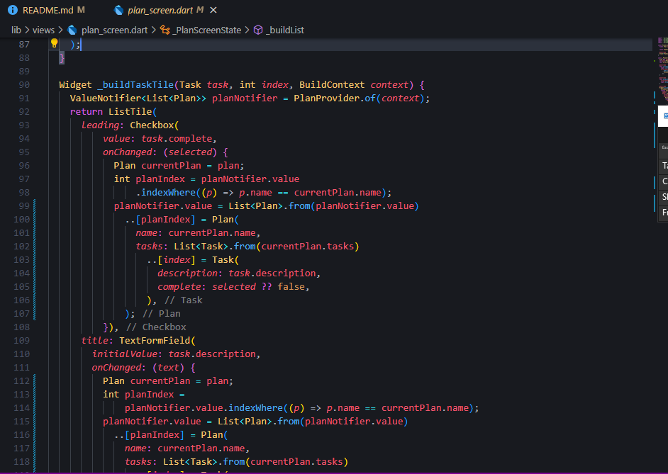

# Hasil-nya

# Tugas Praktikum 1
1. Jelaskan maksud dari langkah 4 pada praktikum tersebut! Mengapa dilakukan
demikian?
- Langkah 4 bertujuan untuk menyederhanakan proses impor model pada file-file lain dalam aplikasi. Dengan membuat file bernama data_layer.dart yang berfungsi sebagai "wrapper" atau pembungkus untuk mengimpor beberapa model sekaligus, kita bisa lebih mudah mengelola dan mengimpor berbagai model dalam satu kali impor.
- Dengan data_layer.dart, kita tidak perlu mengimpor plan.dart dan task.dart secara terpisah di setiap file yang membutuhkannya. Cukup mengimpor data_layer.dart, dan otomatis kita sudah mendapatkan akses ke Plan dan Task.
- Setiap kali model baru ditambahkan ke aplikasi, kita hanya perlu menambahkannya ke dalam data_layer.dart, dan kita tidak perlu mengubah impor di semua file lain. Ini mengurangi risiko kesalahan karena lupa mengimpor model yang diperlukan.

2. Mengapa perlu variabel plan di langkah 6 pada praktikum tersebut? Mengapa dibuat
konstanta ?
- Variabel plan di langkah 6 berfungsi sebagai instance dari model Plan yang akan digunakan di dalam kelas _PlanScreenState. Ini adalah objek yang menyimpan data terkait rencana atau “plan” yang akan ditampilkan atau dimanipulasi dalam antarmuka pengguna.
- Variabel plan dideklarasikan sebagai konstanta const Plan() karena, dalam contoh kode ini, Plan diinisialisasi tanpa parameter. Dengan menjadikannya konstanta, kita memastikan bahwa objek Plan tersebut tidak berubah setelah inisialisasi.

3. Lakukan capture hasil dari Langkah 9 berupa GIF, kemudian jelaskan apa yang telah
Anda buat!

- Widget ini akan menampilkan daftar tugas dalam bentuk ListTile, dengan checkbox untuk status selesai dan TextFormField untuk deskripsi. Ketika pengguna mengubah status atau deskripsi tugas, tampilan akan diperbarui secara langsung.

4. Apa kegunaan method pada Langkah 11 dan 13 dalam lifecyle state ?
- initState() digunakan untuk
- Inisialisasi ScrollController dan menambahkan listener untuk menutup keyboard saat layar di-scroll.
- dispose() digunakan untuk
- Membersihkan ScrollController ketika widget sudah tidak lagi digunakan, untuk menghindari memory leak dan menjaga performa aplikasi.